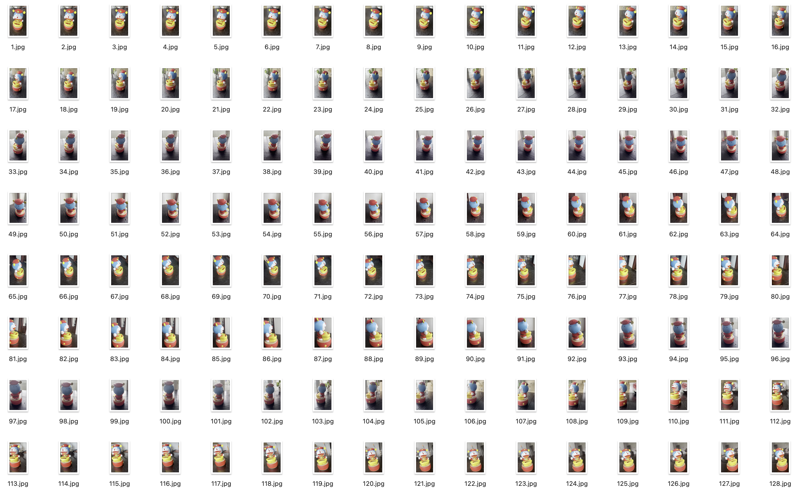
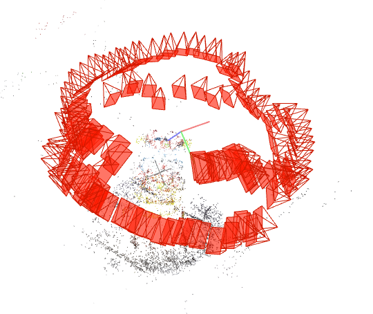

# 作业三：NeRF-pytorch复现

## 前言
本项目用于在自己的数据集上复现nerf的效果

理论参考:
[论文解读](https://www.bilibili.com/video/BV1CC411V7oq/?spm_id_from=333.337.search-card.all.click&vd_source=0fbfb8d661ad4bc042e989ccabc1f48e)

- 前处理：
将不同的图片（每张图片都带一个相机的位置以及位资），输入模型进行体渲染，将图片中的每个像素在自己对应的相机坐标以及位资找到相对应的射线，在每条射线上进行概率采样（概率在一开始是均匀采样，后面训练代数多了以后也会学习相应分布，从而替换该概率），对采样后的粒子进行位置编码，随后输入神经网络。

- 网络架构：
网络架构分为两个8层的MLP网络，非常简单，首先第一个8层网络用于估计粒子的概率密度函数，输出到第二个8层网络后，第二个网络用来估计每个射线上粒子的RGB值。

  

- 后处理
将网络的输出再次进行体渲染，在对应的射线粒子位置上填充RGB值，最后输出。


## 项目实践:
[项目参考](https://github.com/yenchenlin/nerf-pytorch)，
项目中虽然有现存的demo可以直接下载数据集调用进行训练并可视化效果，但是数据集的构建并没有体现，因此本项目主要目的是构建自己的数据集并进行训练。

* 安装

  ```sh
  git clone https://github.com/yenchenlin/nerf-pytorch.git
  cd nerf-pytorch
  pip install -r requirements.txt
  ```
**数据集构建**
- 拍取视频并抽帧得到图片数据集
  
  

  接下来对视频的内容进行抽帧，得到一组图片:
  ```python
  import ffmpeg
  import os

  input_video = './material/IMG_5346.MOV'
  output_path = './data/nerf_llff_data/Doramon/images/%d.jpg'

  # 创建输出目录（如果尚未存在）
  os.makedirs(output_path, exist_ok=True)

  # 删除文件夹中的所有文件
  for file in os.listdir(output_path):
      os.remove(os.path.join(output_path, file))

  # 使用 ffmpeg-python 进行转换，每2帧提取一帧
  ffmpeg.input(input_video).output(output_path, vf='fps=2').run()
  ```
  
得到拍摄物品的数据集

- 使用colmap进行匹配得到图片的相机位资及坐标信息，整合数据得到数据集
  
  下载[colmap](https://demuc.de/colmap/#download)

  将文件导入软件中得到图片的相机信息，主要参考[这里](https://zhuanlan.zhihu.com/p/576416530):
  
  
  
**训练模型**

- 参数
  
  修改[配置文件](./configs/Doramon.txt)，配置文件的格式如下：
  ```python
  expname = Doramon #输出文件夹
  basedir = ./logs 
  datadir = ./data/nerf_llff_data/Doramon #数据集来源
  dataset_type = llff # 数据集的类型

  factor = 8 #下采样比例，这里是8倍
  llffhold = 8 #测试集划分，这里是每8张图片找一张作为测试集

  N_rand = 1024 # 每张图片的射线采样个数
  N_samples = 64 # 每条射线的粒子采样个数
  N_importance = 64 # 模型中第二层MLP对之前的粒子再次重要性采样的个数，这里64=64表示全用

  use_viewdirs = True # 输出可视化结果
  raw_noise_std = 1e0 # 射线的粒子上加入噪声，可以增加起鲁棒性
  ```
  
- 训练
  
  切换到当前文件夹，
  在命令行中直接运行：

  ```sh
  python run_nerf.py --config ./configs/Doramon.txt
  ```
  
  ***PS***：由于imageio的版本问题，在进行下采样时会报错，这里我直接使用其他的库进行了处理：[数据转换](./transform.py)
  ```sh
  python transform.py --dataset Doramon
  ```
- 结果
  
  以下是模型在运行到[50000](./logs/Doramon/prange_spiral_050000_rgb.mp4)、[100000](./logs/Doramon/prange_spiral_100000_rgb.mp4)、[150000](./logs/Doramon/prange_spiral_150000_rgb.mp4)、[200000](./logs/Doramon/prange_spiral_200000_rgb.mp4)代时的效果

<style>
  .video-container {
    display: flex;
    flex-wrap: wrap;
    justify-content: space-between;
  }
  .video-item {
    flex: 1 1 22%; /* 每个视频占据 22% 的宽度，剩下的用于间距 */
    margin: 5px;
    text-align: center; /* 居中文本 */
  }
  .video-item video {
    width: 100%;
    height: auto; /* 保持视频的纵横比 */
  }
</style>

<div class="video-container">
  <div class="video-item">
    <video controls>
      <source src="./logs/Doramon/prange_spiral_050000_rgb.mp4" type="video/mp4">
      您的浏览器不支持 HTML5 视频标签。
    </video>
    <p>第50000代</p>
  </div>
  <div class="video-item">
    <video controls>
      <source src="./logs/Doramon/prange_spiral_150000_rgb.mp4" type="video/mp4">
      您的浏览器不支持 HTML5 视频标签。
    </video>
    <p>第100000代</p>
  </div>
  <div class="video-item">
    <video controls>
      <source src="./logs/Doramon/prange_spiral_100000_rgb.mp4" type="video/mp4">
      您的浏览器不支持 HTML5 视频标签。
    </video>
    <p>第150000代</p>
  </div>
  <div class="video-item">
    <video controls>
      <source src="./logs/Doramon/prange_spiral_200000_rgb.mp4" type="video/mp4">
      您的浏览器不支持 HTML5 视频标签。
    </video>
    <p>第200000代</p>
  </div>
</div>
